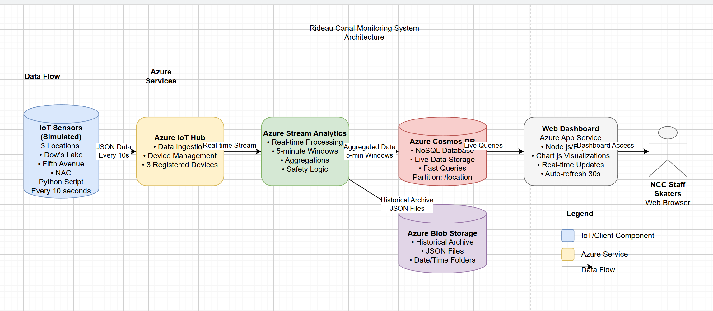

**Rideau Canal Skateway IoT Monitoring System**  
A comprehensive real-time data streaming and visualization system designed to monitor ice conditions at three key locations along Ottawa's historic Rideau Canal Skateway. The system ensures skater safety through continuous IoT sensor monitoring, real-time data processing, and live dashboard visualization.

## Student Information
- **Name:** Bryan Edler
- **Student ID:** 041016930
- **Course:** CST8916 - Fall 2025
- **Institution:** Algonquin College

### Repository Links
- **Main Documentation:** [https://github.com/yourusername/rideau-canal-monitoring](https://github.com/yourusername/rideau-canal-monitoring)
- **Sensor Simulation:** [https://github.com/yourusername/rideau-canal-sensor-simulation](https://github.com/yourusername/rideau-canal-sensor-simulation)
- **Web Dashboard:** [https://github.com/yourusername/rideau-canal-dashboard](https://github.com/yourusername/rideau-canal-dashboard)
- **Live Dashboard:** [https://rideau-canal-dashboard.azurewebsites.net](https://rideau-canal-dashboard.azurewebsites.net)

## Scenario Overview

### Problem Statement
The Rideau Canal Skateway, a UNESCO World Heritage site and premier winter attraction, requires constant monitoring of ice conditions to ensure public safety. Manual ice measurements are inefficient, prone to human error, and cannot provide real-time updates to the National Capital Commission (NCC) staff and skaters.

### System Objectives
1. **Real-time Monitoring:** Continuously monitor ice thickness, temperature, and snow accumulation
2. **Automated Safety Alerts:** Implement logic-based safety status indicators
3. **Historical Data Archival:** Store processed data for analysis and reporting
4. **Accessible Visualization:** Provide live dashboard for NCC staff and public access
5. **Scalable Architecture:** Build on cloud services for reliability and scalability

## System Architecture



### Data Flow Explanation
1. **Data Collection:** Python-simulated IoT sensors at three locations send JSON data every 10 seconds
2. **Data Ingestion:** Azure IoT Hub receives and routes sensor data
3. **Real-time Processing:** Azure Stream Analytics aggregates data in 5-minute windows with safety logic
4. **Data Storage:** 
   - Processed data stored in Cosmos DB for live dashboard queries
   - Historical data archived in Blob Storage for long-term analysis
5. **Visualization:** Node.js web dashboard hosted on Azure App Service displays real-time data
6. **User Access:** NCC staff and skaters access dashboard via web browser

### Azure Services Used
- **Azure IoT Hub:** Device management and data ingestion
- **Azure Stream Analytics:** Real-time data processing
- **Azure Cosmos DB:** NoSQL database for live queries
- **Azure Blob Storage:** Historical data archival
- **Azure App Service:** Web dashboard hosting
- **Azure Resource Groups:** Resource organization and management

## Implementation Overview

### IoT Sensor Simulation
- **Technology:** Python with Azure IoT Device SDK
- **Locations:** Dow's Lake, Fifth Avenue, NAC
- **Frequency:** Data sent every 10 seconds
- **Data Points:** Ice thickness, surface temperature, snow accumulation, external temperature
- **Repository:** [Sensor Simulation Code](https://github.com/yourusername/rideau-canal-sensor-simulation)

### Azure IoT Hub Configuration
- Three registered devices (one per location)
- Symmetric key authentication
- Message routing to Stream Analytics
- Real-time metrics monitoring

### Stream Analytics Job
- **Window Type:** 5-minute tumbling windows
- **Query:** [See complete query below]
- **Outputs:** Cosmos DB and Blob Storage
- **Aggregations:** Averages, min/max values, safety status calculation

```sql
WITH SensorData AS (
    SELECT
        CASE 
            WHEN deviceId = 'dows-lake-sensor' THEN 'dows-lake'
            WHEN deviceId = 'fifth-avenue-sensor' THEN 'fifth-avenue'
            WHEN deviceId = 'nac-sensor' THEN 'nac'
            ELSE 'unknown'
        END as location,
        CAST(iceThickness AS float) as iceThickness,
        CAST(surfaceTemperature AS float) as surfaceTemperature,
        CAST(snowAccumulation AS float) as snowAccumulation,
        CAST(externalTemperature AS float) as externalTemperature,
        System.Timestamp as windowEnd,
        CAST(timestamp AS datetime) as eventTime
    FROM [iot-hub-input]
    WHERE iceThickness IS NOT NULL
),

AggregatedData AS (
    SELECT
        System.Timestamp as windowEnd,
        location,
        AVG(iceThickness) as avgIceThickness,
        MIN(iceThickness) as minIceThickness,
        MAX(iceThickness) as maxIceThickness,
        AVG(surfaceTemperature) as avgSurfaceTemperature,
        MIN(surfaceTemperature) as minSurfaceTemperature,
        MAX(surfaceTemperature) as maxSurfaceTemperature,
        MAX(snowAccumulation) as maxSnowAccumulation,
        AVG(externalTemperature) as avgExternalTemperature,
        COUNT(*) as readingCount,
        CASE
            WHEN AVG(iceThickness) >= 30 AND AVG(surfaceTemperature) <= -2 THEN 'Safe'
            WHEN AVG(iceThickness) >= 25 AND AVG(surfaceTemperature) <= 0 THEN 'Caution'
            ELSE 'Unsafe'
        END as safetyStatus
    FROM SensorData
    GROUP BY location, TumblingWindow(minute, 5)
)

-- Output to Cosmos DB
SELECT
    location + '-' + SUBSTRING(CAST(windowEnd AS nvarchar(max)), 1, 19) as id,
    location,
    windowEnd as timestamp,
    ROUND(avgIceThickness, 1) as avgIceThickness,
    ROUND(minIceThickness, 1) as minIceThickness,
    ROUND(maxIceThickness, 1) as maxIceThickness,
    ROUND(avgSurfaceTemperature, 1) as avgSurfaceTemperature,
    ROUND(minSurfaceTemperature, 1) as minSurfaceTemperature,
    ROUND(maxSurfaceTemperature, 1) as maxSurfaceTemperature,
    ROUND(maxSnowAccumulation, 1) as maxSnowAccumulation,
    ROUND(avgExternalTemperature, 1) as avgExternalTemperature,
    readingCount,
    safetyStatus
INTO [cosmosdb-output]
FROM AggregatedData

-- Output to Blob Storage
SELECT *
INTO [blob-output]
FROM AggregatedData
```

### Cosmos DB Setup
- **Database:** RideauCanalDB
- **Container:** SensorAggregations
- **Partition Key:** /location
- **Document ID Format:** {location}-{timestamp}
- **Indexing:** Automatic on all paths

### Blob Storage Configuration
- **Container:** historical-data
- **Path Pattern:** aggregations/{date}/{time}/
- **File Format:** Line-separated JSON
- **Retention:** All historical data preserved

### Web Dashboard
- **Frontend:** HTML/CSS/JavaScript with Chart.js
- **Backend:** Node.js with Express
- **Features:** Real-time updates, safety badges, trend charts, auto-refresh
- **Repository:** [Dashboard Code](https://github.com/yourusername/rideau-canal-dashboard)

### Azure App Service Deployment
- **Runtime Stack:** Node.js 18 LTS
- **Pricing Tier:** F1 (Free) / B1 (Basic)
- **Environment Variables:** Cosmos DB credentials
- **Deployment Method:** Local Git / Zip Deploy
- **URL:** https://rideau-canal-dashboard.azurewebsites.net

## Repository Links

### 1. Main Documentation Repository
- **URL:** https://github.com/yourusername/rideau-canal-monitoring
- **Contents:** Project documentation, architecture diagrams, screenshots, implementation guides

### 2. Sensor Simulation Repository
- **URL:** https://github.com/yourusername/rideau-canal-sensor-simulation
- **Technology:** Python with Azure IoT SDK
- **Purpose:** Simulates three IoT sensors sending data to Azure IoT Hub

### 3. Web Dashboard Repository
- **URL:** https://github.com/yourusername/rideau-canal-dashboard
- **Technology:** Node.js, Express, Chart.js, Azure Cosmos DB SDK
- **Purpose:** Real-time monitoring dashboard with visualization

### Live Deployment
- **Dashboard URL:** https://rideau-canal-dashboard.azurewebsites.net
- **Status:** Active and monitoring real-time data

## Video Demonstration


**Video Contents:**
1. Introduction and project overview
2. System architecture walkthrough
3. Live demonstration of all components
4. Code walkthrough of key components
5. Challenges and solutions


## Setup Instructions

### Prerequisites
1. **Azure Account:** Free student subscription
2. **Python 3.8+:** For sensor simulation
3. **Node.js 18+:** For dashboard development
4. **Git:** For version control
5. **VS Code:** Recommended IDE

### High-Level Setup Steps

1. **Azure Infrastructure Setup**
   - Create Resource Group
   - Deploy IoT Hub with 3 devices
   - Create Cosmos DB account
   - Set up Blob Storage container
   - Configure Stream Analytics job
   - Deploy App Service for dashboard

2. **Sensor Simulation Setup**
   ```bash
   git clone https://github.com/yourusername/rideau-canal-sensor-simulation
   cd rideau-canal-sensor-simulation
   pip install -r requirements.txt
   # Update .env with device connection strings
   python sensor_simulator.py
   ```

3. **Dashboard Setup**
   ```bash
   git clone https://github.com/yourusername/rideau-canal-dashboard
   cd rideau-canal-dashboard
   npm install
   npm start
   ```

4. **Deployment to Azure**
   - Configure App Service environment variables
   - Deploy dashboard code via Git or Zip
   - Start Stream Analytics job
   - Verify end-to-end data flow


## Results and Analysis

### Sample Outputs

#### Sensor Data (Raw)
```json
{
  "deviceId": "dows-lake-sensor",
  "location": "Dow's Lake",
  "timestamp": "2024-12-16T13:00:00Z",
  "iceThickness": 32.5,
  "surfaceTemperature": -2.5,
  "snowAccumulation": 5.2,
  "externalTemperature": -1.8
}
```

#### Aggregated Data (Processed)
```json
{
  "id": "dows-lake-2024-12-16T13:05:00",
  "location": "dows-lake",
  "timestamp": "2024-12-16T13:05:00",
  "avgIceThickness": 32.5,
  "minIceThickness": 30.2,
  "maxIceThickness": 34.8,
  "avgSurfaceTemperature": -2.5,
  "minSurfaceTemperature": -3.1,
  "maxSurfaceTemperature": -1.9,
  "maxSnowAccumulation": 8.7,
  "avgExternalTemperature": -1.8,
  "readingCount": 30,
  "safetyStatus": "Safe"
}
```

### Screenshots
- [IoT Hub Devices](screenshots/01-iot-hub-devices.png)
- [IoT Hub Metrics](screenshots/02-iot-hub-metrics.png)
- [Stream Analytics Query](screenshots/03-stream-analytics-query.png)
- [Stream Analytics Running](screenshots/04-stream-analytics-running.png)
- [Cosmos DB Data](screenshots/05-cosmos-db-data.png)
- [Blob Storage Files](screenshots/06-blob-storage-files.png)
- [Dashboard Local](screenshots/07-dashboard-local.png)
- [Dashboard Azure](screenshots/08-dashboard-azure.png)

### Data Analysis
- **Data Volume:** 
- **Processing Latency:** 
- **Storage Efficiency:** 
- **Reliability:** 

### System Performance Observations
1. **Real-time Capability:** Dashboard updates within 30 seconds of sensor reading
2. **Scalability:** Architecture supports adding more sensors without redesign
3. **Cost Efficiency:** Serverless options (Cosmos DB serverless) reduce costs
4. **Reliability:** Azure services provide 99.9% SLA for production readiness
5. **Security:** All connections use secure protocols and managed identities

## Challenges and Solutions

### Technical Challenges Faced

#### Challenge 1: Stream Analytics Output Configuration
**Problem:** Difficulty connecting Stream Analytics to Cosmos DB with correct partition key
**Solution:** Used manual connection string method instead of dropdown selection, ensuring proper partition key format (`/location`)

#### Challenge 2: App Service Environment Variables
**Problem:** New Azure Portal interface made finding Configuration settings difficult
**Solution:** Discovered "Environment Variables" section in App Service settings, configured all required variables there

#### Challenge 3: Cost Management
**Problem:** Free tier limitations on Azure services
**Solution:** Used F1 tier for App Service, serverless Cosmos DB, and monitored usage to stay within limits

#### Challenge 4: Real-time Data Sync
**Problem:** Dashboard showed stale data if Cosmos DB queries weren't optimized
**Solution:** Implemented timestamp-based queries with proper indexing and client-side caching


### How Challenges Were Solved
1. **Documentation Research:** Referenced official Azure documentation and tutorials
2. **Community Support:** Used Stack Overflow and Microsoft Q&A forums
3. **Trial and Error:** Tested different configurations until success
4. **Monitoring Tools:** Used Azure Monitor and Application Insights for debugging
5. 4. **Using AI Guide:** AI answered many questions and helped me find errors that I made

## AI Tools Disclosure

### AI Tools Used
- **ChatGPT (OpenAI):** Used for code generation (mostly for sql), debugging assistance, and documentation structuring
- **GitHub Copilot:** Assisted with code completion and syntax suggestions

### Purpose and Extent
1. **Code Generation:** 
   - Initial boilerplate code query.sql
   - Stream Analytics query structure
   - Configuration file templates

2. **Debugging Assistance:**
   - Error message interpretation
   - Troubleshooting Azure service connectivity issues
   - Performance optimization suggestions

3. **Documentation:**
   - README structure and formatting
   - Technical explanation refinement
   - Architecture diagram description


**Verification Process:** All AI-generated code was thoroughly reviewed, tested, and modified to ensure understanding and functionality. Every line of code was executed and validated in the actual Azure environment.

## References

### Libraries and Frameworks
1. **Azure IoT Device SDK for Python:** Device connectivity
2. **Azure Cosmos DB SDK for Node.js:** Database operations
3. **Express.js:** Web server framework
4. **Chart.js:** Data visualization
5. **dotenv:** Environment variable management

### Azure Documentation
- [Azure IoT Hub Documentation](https://docs.microsoft.com/en-us/azure/iot-hub/)
- [Azure Stream Analytics Documentation](https://docs.microsoft.com/en-us/azure/stream-analytics/)
- [Azure Cosmos DB Documentation](https://docs.microsoft.com/en-us/azure/cosmos-db/)
- [Azure App Service Documentation](https://docs.microsoft.com/en-us/azure/app-service/)

### Learning Resources
- Microsoft Learn: "Implement IoT Solutions"
- Azure Architecture Center: Real-time analytics patterns
- Node.js Best Practices for Production
- Chart.js Documentation for Real-time Charts

### Open Source Tools
- Draw.io for architecture diagrams
- VS Code with Azure extensions
- Postman for API testing
- Git for version control

---

## License
This project is developed for educational purposes as part of CST8916 - Fall 2025 coursework. All Azure resources should be cleaned up after project evaluation to avoid unnecessary charges.

## Acknowledgments
- National Capital Commission (NCC) for the project scenario
- Microsoft Azure for providing student credits
- Course instructors for guidance and support
- Open source community for valuable tools and libraries

